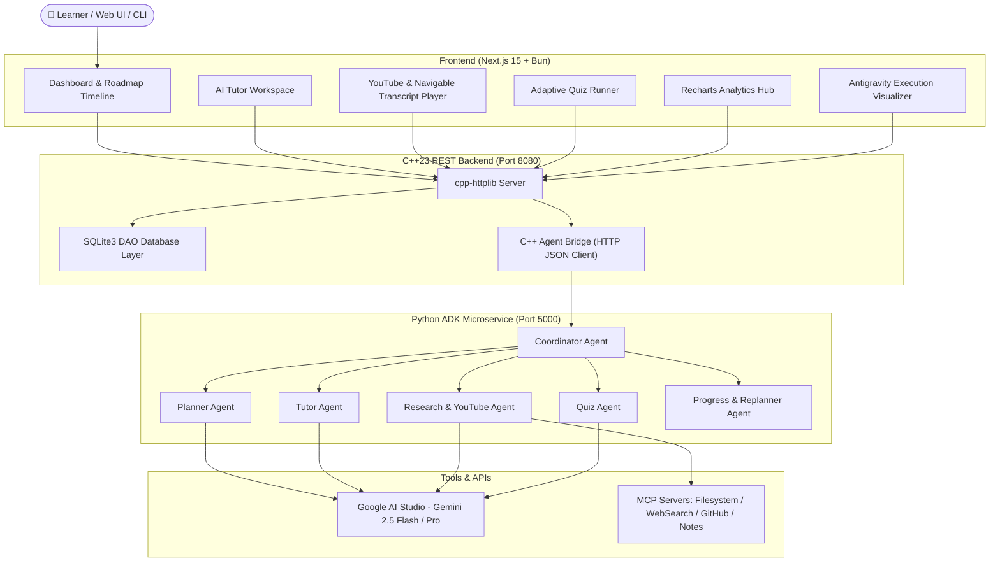
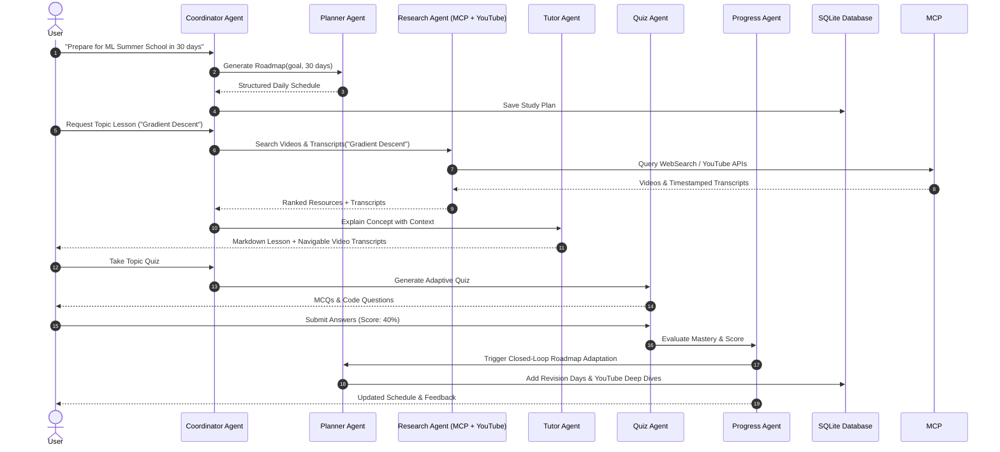

# StudyMate AI 🎓 — Autonomous Multi-Agent Learning Companion

> **Kaggle AI Agents: Intensive Vibe Coding Capstone Project (Concierge Agents Track)**  
> Built with **C++23**, **Google ADK + Gemini API**, **SQLite3**, **Next.js 15 (Bun)**, and **Model Context Protocol (MCP)**.

---

## 🌟 Executive Summary

**StudyMate AI** transforms learning from passive Q&A into an **autonomous learning manager**. Students waste countless hours juggling disconnected YouTube videos, PDFs, flashcards, Notion pages, and search queries.

StudyMate AI automates the entire journey:
1. **Autonomous Planning**: Generates customized multi-day roadmaps based on goal and time constraints.
2. **Resource Discovery**: Leverages **MCP Tools** (Filesystem, Web Search, GitHub, Notes) to find and rank study materials.
3. **Interactive YouTube & Navigable Transcripts**: Fetches educational videos and renders an interactive transcript player where clicking any timestamp instantly jumps the video player.
4. **Personalized Tutoring**: Adapts explanations to user experience levels and historical weak spots.
5. **Adaptive Quizzing & Replanning**: Tests concept mastery with quizzes and dynamically adjusts future study schedules based on quiz scores (closed-loop autonomy).
6. **Antigravity Traces & CLI Skill**: Provides live multi-agent execution visualizers and a full-featured terminal CLI tool (`studymate`).

---

## 📐 System Architecture Diagram



---

## 🤖 Multi-Agent Flow Diagram



---

## 🗄️ Database Schema (SQLite3)

```sql
CREATE TABLE study_plans (
    id TEXT PRIMARY KEY,
    goal TEXT NOT NULL,
    total_days INTEGER NOT NULL,
    hours_per_day INTEGER NOT NULL,
    created_at TEXT NOT NULL,
    data_json TEXT NOT NULL
);

CREATE TABLE quizzes (
    id TEXT PRIMARY KEY,
    topic TEXT NOT NULL,
    difficulty TEXT NOT NULL,
    data_json TEXT NOT NULL
);

CREATE TABLE quiz_results (
    id INTEGER PRIMARY KEY AUTOINCREMENT,
    quiz_id TEXT NOT NULL,
    topic TEXT NOT NULL,
    score INTEGER NOT NULL,
    total INTEGER NOT NULL,
    timestamp TEXT NOT NULL
);

CREATE TABLE agent_traces (
    id INTEGER PRIMARY KEY AUTOINCREMENT,
    timestamp TEXT NOT NULL,
    agent_name TEXT NOT NULL,
    action TEXT NOT NULL,
    details TEXT NOT NULL,
    status TEXT NOT NULL
);
```

---

## 🚀 Installation & Local Setup

### Prerequisites
- **C++ Compiler**: GCC 13+, Clang 16+, or MSVC supporting C++23.
- **CMake**: 3.20+
- **Node / Bun**: Bun 1.0+ or Node 20+
- **Python**: Python 3.11+ with `uv`

### 1. Environment Configuration
Copy `.env.example` to `.env` and set your Google AI Studio Gemini API key:
```bash
cp .env.example .env
```

### 2. Launching with Docker Compose (Recommended)
```bash
docker compose up --build
```
This starts:
- **C++ Backend**: `http://localhost:8080`
- **Python ADK Service**: `http://localhost:5000`
- **Next.js Frontend**: `http://localhost:3000`

### 3. Manual Build & Execution

#### C++ Backend
```bash
cd backend
mkdir build && cd build
cmake ..
cmake --build .
./studymate_server
```

#### Run C++ Unit Tests
```bash
./studymate_tests
```

#### Python ADK Microservice (using `uv`)
```bash
cd python_agent
uv run python main.py
```

#### Run Python Pytest Suite
```bash
uv run pytest tests/
```

#### Next.js Frontend
```bash
cd frontend
bun install
bun run dev
```

#### CLI Agent Skill
```bash
cd cli
npm install
npm run build
node dist/index.js explain --topic "Gradient Descent"
```

---

## 💻 CLI Agent Commands (`studymate`)

```bash
# Generate study plan
studymate plan --goal "Learn Machine Learning" --days 30 --hours 2

# Ask Tutor Agent to explain a concept (Requested Feature)
studymate explain --topic "Gradient Descent" --context Beginner

# Generate adaptive quiz
studymate quiz --topic "Linear Algebra" --difficulty medium

# Check mastery analytics
studymate progress
```

---

## 🎯 Demonstrated Kaggle Course Concepts

| Key Concept | Implementation in StudyMate AI |
| :--- | :--- |
| **Agent / Multi-Agent System (ADK)** | Coordinator, Planner, Tutor, Research, Quiz, and Progress agents orchestrated via Python Google ADK microservice. |
| **MCP Server** | Integrated Model Context Protocol (MCP) clients for Filesystem, Web Search, GitHub, and Notes retrieval. |
| **Antigravity** | Real-time agent execution trace visualizer in the UI and log streams. |
| **Security Features** | Zero hardcoded secrets, `.env` management, permission guards, sanitized prompts. |
| **Deployability** | One-command full-stack containerization via `docker-compose.yml` and Dockerfiles. |
| **Agent Skills / CLI** | Command-line tool (`studymate`) supporting plan creation, quiz generation, and detailed concept explanations. |

---

## 🗺️ Roadmap & Future Directions

- [x] Autonomous multi-agent orchestration.
- [x] Interactive YouTube video player with navigable timestamped transcripts.
- [x] Closed-loop adaptive replanning based on quiz performance.
- [x] C++ backend with Ponytail harness clean architecture.
- [ ] Direct Google Calendar MCP integration for automatic study session booking.
- [ ] Anki flashcard export for spaced-repetition sync.

---

## 📄 License

Distributed under the **MIT License**. See [`LICENSE`](LICENSE) for details.
